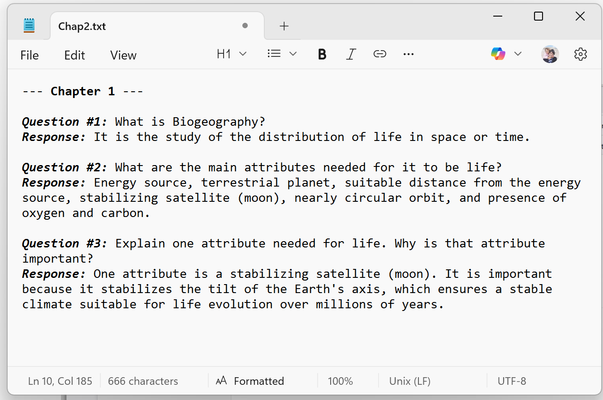
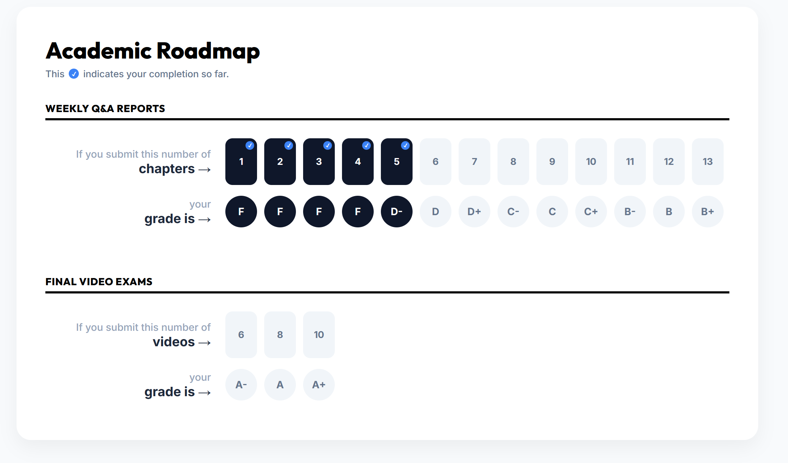

# Welcome {-}

Welcome to Global Environmental Issues.


```{js, echo = FALSE}
title=document.getElementById('header');
title.innerHTML = '' + title.innerHTML
```

<center>

<iframe width="560" height="315" src="https://www.youtube.com/embed/-kfnXVJ_XVo" title="YouTube video player" frameborder="0" allow="accelerometer; autoplay; clipboard-write; encrypted-media; gyroscope; picture-in-picture" allowfullscreen></iframe>


</center>


This course reviews the fundamental processes that maintain populations, species, and communities in nature. It will then present how different human threats influence each of those patterns and processes, illustrating with up-to-date statistics the current extent of human threats, status of biodiversity worldwide and solutions to the current biological crisis of the planet.

```{block2, type='rmdtip'}
**LEARNING OBJECTIVES**: 
Students will be able to describe examples of how Earth systems are connected, how natural resources are created, used and misused by people; be able to explain some of the potential ecological outcomes of different traditional resource management practices; and integrate theory and evidence to evaluate tradeoffs between delivering food, energy, and water production to humanity while ensuring the long term viability of nature.
```


[Sillabus](https://github.com/Camilo-Mora/GEO302/raw/main/main/Conservation Biology Sillabous.pdf) <br>
[Introduction Slides](https://github.com/Camilo-Mora/GEO302/raw/main/main/Class 00 Intro Observation and Interpretation.pptx) <br>


# Your Roadmap in this Class {- #roadmap-style}

Here I explain your expected work in this course; the following page, provides extended details about how this work translates to your grade for this class.


### **Phase A: Submitting Weekly Q&A** {-}

<span style="font-size: 0.8em;"> *This determines your grade up to a **B+**.  Each week, by the end of Sunday, you have to submit the Q&A report of a chapter. You are welcome to submit more if you wish to work ahead. I expect that you would expend quality time in this phase, which is the reason why I gave such a high proportion of the grade to it.*</span>

I recommend using Chrome, Edge or Firefox to submit your weekly Q&A reports (avoid Safari). 


* **The Workflow:**
    1.  **Chapter Selection:** This course has 13 chapters **numbered** in the Table of Contents on the left sidebar (e.g., **1:**, **2:**); click the current week's chapter.
    2.  **Get Questions:** On the chapter page, click the **"Exam questions"** link to see the specific list of questions you need to answer.
    3.  **Watch & Answer:** Watch the lecture video **located on that same page** and **collect** the answers as you watch. The lecture contains all the information needed to respond to the questions.
    4.  **Submit to iStudy:** Save your answers as a file (e.g., Text, or photo of your handwritten responses). Upload that file to the iStudy App (link provided in the Table of Contents on the left sidebar). The iStudy app will provide feedback and generate a revised version of your responses for your records. 
    
    <br>
    


*   **Submission Rules:**
    *   **Single File Only:** You can only upload **one file** per chapter (containing all answers for the given chapter).
    *   **File Type:** A photo of your handwriting OR a plain text file (`.txt`). 
        *   *If using Word/Excel: Click "Save As" and select "Plain Text (.txt)" before uploading.*
        *   *If you choose to submit handwritten responses, please ensure they are organized and legible. Clearly mark each question number, leave ample white space between responses, and keep your text in straight, orderly lines. While the application is powerful, it cannot accurately transcribe handwriting that is illegible or disorganized.*
    *   **Required Labeling:** Your file **must** clearly state the Chapter Number and Question Numbers. 

<br>
```{block2, type='rmdtip'}
**WARNING**
the iStudy app will download your revised responses to your computer. Save that file as you will need it as proof that you did the work, and as your study guide, if you chooce to take the exam.
```
<br>

{style="display: block; margin: 0 auto; width: 120%;"}

<p style="text-align: center; color: gray; font-size: 0.9em;">*Example of the required formatting for your submissions.*</p>

<br>

> 🚨 **Critical:** Budget **60 minutes** of continuous time to deliver your Q&A report. Due to privacy issues, the app does not save progress; if you stop, you must start from the beginning of that chapter.

<br>

<hr style="border: 0.5px solid #ddd;">

<br>

### **Phase B: Submitting Exam Videos** {-}

*The exam is voluntary to reach the **A territory** (A-, A, or A+). These videos are due any time after you finish Phase A and before the last day of class.*


*   **The Workflow:**
    1.  **Preparation:** Study your **Revised Response Reports** from Phase A until you master the logic of each question.
    2.  **Record (One Video Per Chapter):**
        *   Film yourself responding to **all** questions for that chapter. You choose which chapters to record.
        *   **Format:** Facing the camera, state the question clearly (this you can read from a paper or your computer screen), then provide the response from memory (for the response you cannot use any external help; that will be seen as cheating).
        *   **Integrity:** No notes allowed; this is an oral proof of mastery. If I suspect cheating, you may be asked to re-do the videos.
        *   **Validation:** If your responses are incorrect, it may indicate Phase A was not completed properly, and you may be asked to provide evidence of your weekly Q&A reports.

<br>

*   **Delivery:**
(**Create one video per lecture** and submit which ever many for the grade that you want; see Grading section).
    1.  **Post:** Post your videos to YouTube (Public or Unlisted).
    2.  **Upload:** Load the URL of each chapter video exam in the IStudy app.


<br>

<br>
```{block2, type='rmdtip'}
**WARNING**
The video exams are voluntary if you are aiming for a grade in the A territory for this class.  If you choose to take the video exam, you need to submit excellent videos with all the responses for six chapter for an A-, eight chapters for an A, and 10 chapters for an A+. 
```
<br>


# 📝 Grading {-}


Your grade in this class is transparent and proportional to the content you master in this class. It follows the image below. 

To read the image, check for instance, that to get an B+ you need to deliver all 13 weekly Q&A reports via the app, you may choose a B and that requires to submit at least 12 chapters, etc.

If you choose to take the exam, you need to submit excellent videos with all the responses for six chapter for an A-, eight chapters for an A, and 10 chapters for an A+. 

Each week as you deliver your Q&A reports, the app will display your current grade.




# Launch iStudy App {-}

After you have watched a video for a given chapter, and collected all your responses in an image or text file, load them in this app:

Expect to work at least 60 minutes reviewing your responses for any given chapter. The app cannot save data so if you do not finish submitting all your work in one go, you will have to start from scratch, so please be warned of this time requirement.


[](https://camilo-mora.github.io/iStudy/302/){target="_blank"}


# 1: Biodiversity patterns and drivers {-}
[Slides](https://github.com/Camilo-Mora/GEO302/raw/main/main/Class%2001%20global%20biodiversity.pptx) <br>
[Exam questions](https://github.com/Camilo-Mora/GEO302/raw/main/main/ExamQuestions_01.xlsx)
<center>
<iframe width="560" height="315" src="https://www.youtube.com/embed/W9FUcPHeIKs" title="YouTube video player" frameborder="0" allow="accelerometer; autoplay; clipboard-write; encrypted-media; gyroscope; picture-in-picture" allowfullscreen></iframe>
[Transcript](https://github.com/Camilo-Mora/GEO302/raw/main/main/Transcript_Lecture_01.txt)
</center>

# 2: Biodiversity, its value and need for conservation {-}
[Slides](https://github.com/Camilo-Mora/GEO302/raw/main/main/Class 02 Biodiversity, its value and need for conservation.ppt) <br>
[Exam questions](https://github.com/Camilo-Mora/GEO302/raw/main/main/ExamQuestions_02.xlsx)

<center>
<iframe width="560" height="315" src="https://www.youtube.com/embed/MbaomTh04Zo" title="YouTube video player" frameborder="0" allow="accelerometer; autoplay; clipboard-write; encrypted-media; gyroscope; picture-in-picture" allowfullscreen></iframe>
[Transcript](https://github.com/Camilo-Mora/GEO302/raw/main/main/Transcript_Lecture_02.txt)
</center>    
    
# 3: Global trends in marine and terrestrial biodiversity {-}
[Slides](https://github.com/Camilo-Mora/GEO302/raw/main/main/Class 03 Trends in biodiversity.ppt) <br>
[Exam questions](https://github.com/Camilo-Mora/GEO302/raw/main/main/ExamQuestions_03.xlsx)
<center>
<iframe width="560" height="315" src="https://www.youtube.com/embed/9MMclHY_U5Y" title="YouTube video player" frameborder="0" allow="accelerometer; autoplay; clipboard-write; encrypted-media; gyroscope; picture-in-picture" allowfullscreen></iframe>  
[Transcript](https://github.com/Camilo-Mora/GEO302/raw/main/main/Transcript_Lecture_03.txt)
</center>    
    
    
# 4: Extinction {-}
[Slides](https://github.com/Camilo-Mora/GEO302/raw/main/main/Class 04 Extinciton.pptx) <br>
[Exam questions](https://github.com/Camilo-Mora/GEO302/raw/main/main/ExamQuestions_04.xlsx)
<center>
<iframe width="560" height="315" src="https://www.youtube.com/embed/7JYyegDSW6M" title="YouTube video player" frameborder="0" allow="accelerometer; autoplay; clipboard-write; encrypted-media; gyroscope; picture-in-picture" allowfullscreen></iframe> 
[Transcript](https://github.com/Camilo-Mora/GEO302/raw/main/main/Transcript_Lecture_04.txt)
</center>    
    
# Causes of biodiversity loss:  {-}
## 5: Overexploitation {-}
[Slides](https://github.com/Camilo-Mora/GEO302/raw/main/main/Class 05 Overexploitation.pptx) <br>
[Exam questions](https://github.com/Camilo-Mora/GEO302/raw/main/main/ExamQuestions_05.xlsx)
<center>
<iframe width="560" height="315" src="https://www.youtube.com/embed/Zx15ipqWJsU" title="YouTube video player" frameborder="0" allow="accelerometer; autoplay; clipboard-write; encrypted-media; gyroscope; picture-in-picture" allowfullscreen></iframe>
[Transcript](https://github.com/Camilo-Mora/GEO302/raw/main/main/Transcript_Lecture_05.txt)
</center>    
    
## 6: Habitat loss {-}
[Slides](https://github.com/Camilo-Mora/GEO302/raw/main/main/Class 06 Habitat loss.pptx) <br>
[Exam questions](https://github.com/Camilo-Mora/GEO302/raw/main/main/ExamQuestions_06.xlsx)
<center>
<iframe width="560" height="315" src="https://www.youtube.com/embed/knN8lZz5AkM" title="YouTube video player" frameborder="0" allow="accelerometer; autoplay; clipboard-write; encrypted-media; gyroscope; picture-in-picture" allowfullscreen></iframe>
[Transcript](https://github.com/Camilo-Mora/GEO302/raw/main/main/Transcript_Lecture_06.txt)
</center>    
    
## 7: Climate change {-}
[Slides](https://github.com/Camilo-Mora/GEO302/raw/main/main/Class 07 Climate change.pptx) <br>
[Exam questions](https://github.com/Camilo-Mora/GEO302/raw/main/main/ExamQuestions_07.xlsx)
<center><iframe width="560" height="315" src="https://www.youtube.com/embed/TTYmvMsdlBE" title="YouTube video player" frameborder="0" allow="accelerometer; autoplay; clipboard-write; encrypted-media; gyroscope; picture-in-picture" allowfullscreen></iframe>
[Transcript](https://github.com/Camilo-Mora/GEO302/raw/main/main/Transcript_Lecture_07.txt)
</center>


## 8: Over-population  {-}
[Slides](https://github.com/Camilo-Mora/GEO302/raw/main/main/Class 08 Human overpopulation and comsuption.pptx) <br>
[Exam questions](https://github.com/Camilo-Mora/GEO302/raw/main/main/ExamQuestions_08.xlsx)
<center>
<iframe width="560" height="315" src="https://www.youtube.com/embed/pAu7tAxmu60" title="YouTube video player" frameborder="0" allow="accelerometer; autoplay; clipboard-write; encrypted-media; gyroscope; picture-in-picture" allowfullscreen></iframe>
[Transcript](https://github.com/Camilo-Mora/GEO302/raw/main/main/Transcript_Lecture_08.txt)
</center>    
    
# Solutions to biodiversity loss:  {-}
## 9:  Overexploitation {-}
[Slides](https://github.com/Camilo-Mora/GEO302/raw/main/main/Class 09 Harvesting regulation.pptx) <br>
[Exam questions](https://github.com/Camilo-Mora/GEO302/raw/main/main/ExamQuestions_09.xlsx)
<center>
<iframe width="560" height="315" src="https://www.youtube.com/embed/uLHaDBTZD2E" title="YouTube video player" frameborder="0" allow="accelerometer; autoplay; clipboard-write; encrypted-media; gyroscope; picture-in-picture" allowfullscreen></iframe>
[Transcript](https://github.com/Camilo-Mora/GEO302/raw/main/main/Transcript_Lecture_09.txt)
</center>

## 10: Habitat loss {-}
[Slides](https://github.com/Camilo-Mora/GEO302/raw/main/main/Class 10 Area protection.ppt) <br>
[Exam questions](https://github.com/Camilo-Mora/GEO302/raw/main/main/ExamQuestions_10.xlsx)
<center>
<iframe width="560" height="315" src="https://www.youtube.com/embed/ykGXN-O4fOU" title="YouTube video player" frameborder="0" allow="accelerometer; autoplay; clipboard-write; encrypted-media; gyroscope; picture-in-picture" allowfullscreen></iframe>
[Transcript](https://github.com/Camilo-Mora/GEO302/raw/main/main/Transcript_Lecture_10.txt)
</center>

## 11: Climate change {-}
[Slides](https://github.com/Camilo-Mora/GEO302/raw/main/main/Class 11 regulation CO2 emmisions.pptx) <br>
[Exam questions](https://github.com/Camilo-Mora/GEO302/raw/main/main/ExamQuestions_11.xlsx)
<center>
<iframe width="560" height="315" src="https://www.youtube.com/embed/U55NdjuEy-4" title="YouTube video player" frameborder="0" allow="accelerometer; autoplay; clipboard-write; encrypted-media; gyroscope; picture-in-picture" allowfullscreen></iframe>
[Transcript](https://github.com/Camilo-Mora/GEO302/raw/main/main/Transcript_Lecture_11.txt)
</center>

## 12: Overpopulation  {-}
[Slides](https://github.com/Camilo-Mora/GEO302/raw/main/main/Class 12 Regulating Overpopulation.pptx) <br>
[Exam questions](https://github.com/Camilo-Mora/GEO302/raw/main/main/ExamQuestions_12.xlsx)
<center>
<iframe width="560" height="315" src="https://www.youtube.com/embed/KDLe0ibzbXw" title="YouTube video player" frameborder="0" allow="accelerometer; autoplay; clipboard-write; encrypted-media; gyroscope; picture-in-picture" allowfullscreen></iframe>
[Transcript](https://github.com/Camilo-Mora/GEO302/raw/main/main/Transcript_Lecture_12.txt)
</center>        

# 13: Ultimate solutions {-}
[Slides](https://github.com/Camilo-Mora/GEO302/raw/main/main/Class 13 Future scenarios for our planet.pptx) <br>
[Exam questions](https://github.com/Camilo-Mora/GEO302/raw/main/main/ExamQuestions_13.xlsx)
<center>
<iframe width="560" height="315" src="https://www.youtube.com/embed/WS0x7DQJHMI" title="YouTube video player" frameborder="0" allow="accelerometer; autoplay; clipboard-write; encrypted-media; gyroscope; picture-in-picture" allowfullscreen></iframe>
[Transcript](https://github.com/Camilo-Mora/GEO302/raw/main/main/Transcript_Lecture_13.txt)
</center>


