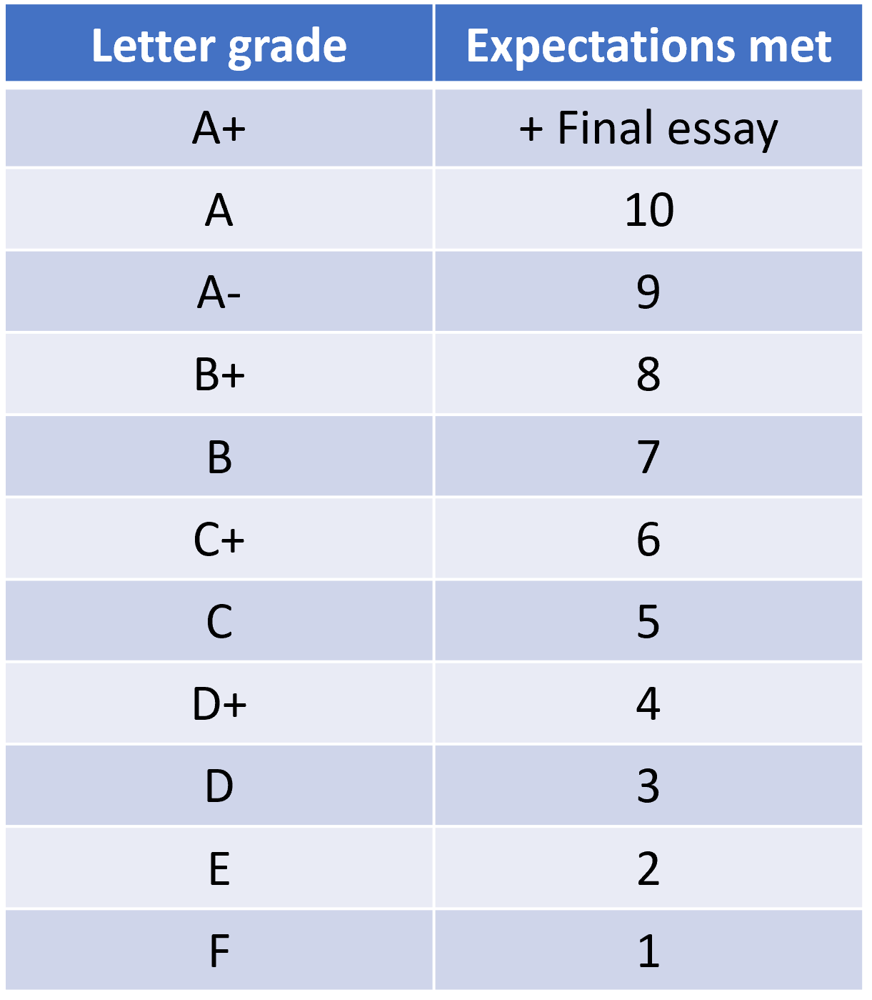

# Welcome {-}

Welcome to Global Environmental Issues.


```{js, echo = FALSE}
title=document.getElementById('header');
title.innerHTML = '' + title.innerHTML
```


This course reviews the fundamental processes that maintain populations, species, and communities in nature. It will then present how different human threats influence each of those patterns and processes, illustrating with up-to-date statistics the current extent of human threats, status of biodiversity worldwide and solutions to the current biological crisis of the planet.

[Sillabus](https://github.com/Camilo-Mora/GEO302/raw/main/main/Conservation Biology Sillabous.doc) <br>
[Introduction Slides](https://github.com/Camilo-Mora/GEO302/raw/main/main/Class 00 Intro Observation and Interpretation.pptx) <br>


# Your tasks {-}

In this class, there are three tasks you have to do:

1. One minute Extinction presentation. For this, you need to investigate a species that has gone recently extinct and tell us why. The goal here is for you to make us very sad. Use images and videos as needed. You have one minute for this presentation.

2. One minute film project. For this, you need to work in a group of four people (you included) to develop a one-minute commercial outlining any problem and its solution. I need you to use **critical thinking** while outlining the question, the answer and how to present it. I need you to brainstorm constantly with your peers..

3. Brief summary, or 10 questions of your own, about each lecture. These essays are due anytime each Friday. Send your essays using the following Instructions:
a. Use GE0302 as the subject.
b. Use the first line of the email to indicate the lecture number.
c. Use the same email to submit all assays (simply reply to the first email), this will ensure all your essays get concatenated in the same email thread (email chain).
d. Once you send your essay to my email, confirm the date in the Google sheet provided. In that sheet, for each lecture, besides your name, you need to write the date you submitted your essay to me. This date should match the date you send me the essay. This sheet is kept so you know how you are doing.

At the end of the semester, I will have hundred of essays to verify from all students in the class, so at that time I would need all your essays to be grouped in the same email chain.

IMPORTANT: Essays submitted past the due date will not be considered towards your grade. You will need a written excuse for each essay you turn past the due date.


# Grading {-}
Your grading in this class is as follow:

50%	Discussion exam  (worth 50 points)		
30%	Group Film (worth 30 points)								
10%	Extinction presentation	 (worth 10 points)				
10% Class participation	 (worth 10 points)					


Class participation relates to each of the 13 essays that you should have turned in on time (unless you have a valid excuse).

Discussion exam relates to your capacity to respond to any of the questions provided for each lecture. Responding correctly to the questions of any given chapter/lecture is worth 6% of your grade.

There were 13 lectures, but you can choose to be tested in only 10. That will reduce the burden of materials you have to study, and avoid topics that may have been hard to learn.

I will simply select any question randomly from the topics you tell me you are skilled about.

AGAIN, YOU CHOOSE THE LECTURES, AND I SELECT THE QUESTIONS.

If you fail to correctly respond to any of the questions, you will have to go back and prepare again.

You may be able to take this exam multiple times as time allows until the last week of the semester. There will be no penalty to take the test again. 

I want to help you get the grade that you want but I also want for you to own/deserve the grade you want. 

You need to add up all the points of the different components of the class, which should be match to the scale below to define your letter grade for this class.

```{r, out.width = "50%", echo= FALSE, fig.align = 'center',fig.cap = 'Grading by letters'}

```


# Extra credit {-}
All lectures have been filmed and are posted in the pages below. All pages are loaded with data, and they all follow a general outline that I describe at the start of each lecture.

However, I appreciate that watching a video for nearly an hour could be tedious. To motivate you to watch these lectures when you can better pay attention and can remain focus, I have introduced three errors in the lectures. If you identify any of such errors, please email it to me. Pointing any of such errors will give you a 5% buffer in your grade.

The errors are simply statements I made that you should be able to challenge with the data given along the different lectures. Please do not reveal the errors to the rest of the class.


# 1: Biodiversity patterns and drivers {-}
[Slides](https://github.com/Camilo-Mora/GEO302/raw/main/main/Class%2001%20global%20biodiversity.pptx) <br>
[Exam questions](https://github.com/Camilo-Mora/GEO302/raw/main/main/ExamQuestions Topic 1.xlsx)
<center>
<iframe width="560" height="315" src="https://www.youtube.com/embed/W9FUcPHeIKs" title="YouTube video player" frameborder="0" allow="accelerometer; autoplay; clipboard-write; encrypted-media; gyroscope; picture-in-picture" allowfullscreen></iframe>
</center>

# 2: Biodiversity, its value and need for conservation {-}
[Slides](https://github.com/Camilo-Mora/GEO302/raw/main/main/Class 02 Biodiversity, its value and need for conservation.ppt) <br>
[Exam questions](https://github.com/Camilo-Mora/GEO302/raw/main/main/ExamQuestions Topic 2.xlsx)

<center>
<iframe width="560" height="315" src="https://www.youtube.com/embed/MbaomTh04Zo" title="YouTube video player" frameborder="0" allow="accelerometer; autoplay; clipboard-write; encrypted-media; gyroscope; picture-in-picture" allowfullscreen></iframe>
</center>    
    
# 3: Global trends in marine and terrestrial biodiversity {-}
[Slides](https://github.com/Camilo-Mora/GEO302/raw/main/main/Class 03 Trends in biodiversity.ppt) <br>
[Exam questions](https://github.com/Camilo-Mora/GEO302/raw/main/main/ExamQuestions Topic 3.xlsx)
<center>
<iframe width="560" height="315" src="https://www.youtube.com/embed/9MMclHY_U5Y" title="YouTube video player" frameborder="0" allow="accelerometer; autoplay; clipboard-write; encrypted-media; gyroscope; picture-in-picture" allowfullscreen></iframe>  
</center>    
    
    
# 4: Extinction {-}
[Slides](https://github.com/Camilo-Mora/GEO302/raw/main/main/Class 04 Extinciton.pptx) <br>
[Exam questions](https://github.com/Camilo-Mora/GEO302/raw/main/main/ExamQuestions Topic 4.xlsx)
<center>
<iframe width="560" height="315" src="https://www.youtube.com/embed/7JYyegDSW6M" title="YouTube video player" frameborder="0" allow="accelerometer; autoplay; clipboard-write; encrypted-media; gyroscope; picture-in-picture" allowfullscreen></iframe> 
</center>    
    
# Causes of biodiversity loss:  {-}
## 5: Overexploitation {-}
[Slides](https://github.com/Camilo-Mora/GEO302/raw/main/main/Class 05 Overexploitation.pptx) <br>
[Exam questions](https://github.com/Camilo-Mora/GEO302/raw/main/main/ExamQuestions Topic 5.xlsx)
<center>
<iframe width="560" height="315" src="https://www.youtube.com/embed/Zx15ipqWJsU" title="YouTube video player" frameborder="0" allow="accelerometer; autoplay; clipboard-write; encrypted-media; gyroscope; picture-in-picture" allowfullscreen></iframe>
</center>    
    
## 6: Habitat loss {-}
[Slides](https://github.com/Camilo-Mora/GEO302/raw/main/main/Class 06 Habitat loss.pptx) <br>
[Exam questions](https://github.com/Camilo-Mora/GEO302/raw/main/main/ExamQuestions Topic 6.xlsx)
<center>
<iframe width="560" height="315" src="https://www.youtube.com/embed/knN8lZz5AkM" title="YouTube video player" frameborder="0" allow="accelerometer; autoplay; clipboard-write; encrypted-media; gyroscope; picture-in-picture" allowfullscreen></iframe>
</center>    
    
## 7: Climate change {-}
[Slides](https://github.com/Camilo-Mora/GEO302/raw/main/main/Class 07 Climate change.pptx) <br>
[Exam questions](https://github.com/Camilo-Mora/GEO302/raw/main/main/ExamQuestions Topic 7.xlsx)
<center><iframe width="560" height="315" src="https://www.youtube.com/embed/TTYmvMsdlBE" title="YouTube video player" frameborder="0" allow="accelerometer; autoplay; clipboard-write; encrypted-media; gyroscope; picture-in-picture" allowfullscreen></iframe>
</center>


## 8: Over-population  {-}
[Slides](https://github.com/Camilo-Mora/GEO302/raw/main/main/Class 08 Human overpopulation and comsuption.pptx) <br>
[Exam questions](https://github.com/Camilo-Mora/GEO302/raw/main/main/ExamQuestions Topic 8.xlsx)
<center>
<iframe width="560" height="315" src="https://www.youtube.com/embed/pAu7tAxmu60" title="YouTube video player" frameborder="0" allow="accelerometer; autoplay; clipboard-write; encrypted-media; gyroscope; picture-in-picture" allowfullscreen></iframe>
</center>    
    
# Solutions to biodiversity loss:  {-}
## 9:  Overexploitation {-}
[Slides](https://github.com/Camilo-Mora/GEO302/raw/main/main/Class 09 Harvesting regulation.pptx) <br>
[Exam questions](https://github.com/Camilo-Mora/GEO302/raw/main/main/ExamQuestions Topic 9.xlsx)
<center>
<iframe width="560" height="315" src="https://www.youtube.com/embed/uLHaDBTZD2E" title="YouTube video player" frameborder="0" allow="accelerometer; autoplay; clipboard-write; encrypted-media; gyroscope; picture-in-picture" allowfullscreen></iframe>
</center>

## 10: Habitat loss {-}
[Slides](https://github.com/Camilo-Mora/GEO302/raw/main/main/Class 10 Area protection.ppt) <br>
[Exam questions](https://github.com/Camilo-Mora/GEO302/raw/main/main/ExamQuestions Topic 10.xlsx)
<center>
<iframe width="560" height="315" src="https://www.youtube.com/embed/ykGXN-O4fOU" title="YouTube video player" frameborder="0" allow="accelerometer; autoplay; clipboard-write; encrypted-media; gyroscope; picture-in-picture" allowfullscreen></iframe>
</center>

## 11: Climate change {-}
[Slides](https://github.com/Camilo-Mora/GEO302/raw/main/main/Class 11 regulation CO2 emmisions.pptx) <br>
[Exam questions](https://github.com/Camilo-Mora/GEO302/raw/main/main/ExamQuestions Topic 11.xlsx)
<center>
<iframe width="560" height="315" src="https://www.youtube.com/embed/U55NdjuEy-4" title="YouTube video player" frameborder="0" allow="accelerometer; autoplay; clipboard-write; encrypted-media; gyroscope; picture-in-picture" allowfullscreen></iframe>
</center>

## 12: Overpopulation  {-}
[Slides](https://github.com/Camilo-Mora/GEO302/raw/main/main/Class 12 Regulating Overpopulation.pptx) <br>
[Exam questions](https://github.com/Camilo-Mora/GEO302/raw/main/main/ExamQuestions Topic 12.xlsx)
<center>
<iframe width="560" height="315" src="https://www.youtube.com/embed/KDLe0ibzbXw" title="YouTube video player" frameborder="0" allow="accelerometer; autoplay; clipboard-write; encrypted-media; gyroscope; picture-in-picture" allowfullscreen></iframe>
</center>        

# 13: Ultimate solutions {-}
[Slides](https://github.com/Camilo-Mora/GEO302/raw/main/main/Class 13 Future scenarios for our planet.pptx) <br>
[Exam questions](https://github.com/Camilo-Mora/GEO302/raw/main/main/ExamQuestions Topic 13.xlsx)
<center>
<iframe width="560" height="315" src="https://www.youtube.com/embed/WS0x7DQJHMI" title="YouTube video player" frameborder="0" allow="accelerometer; autoplay; clipboard-write; encrypted-media; gyroscope; picture-in-picture" allowfullscreen></iframe>
</center>


